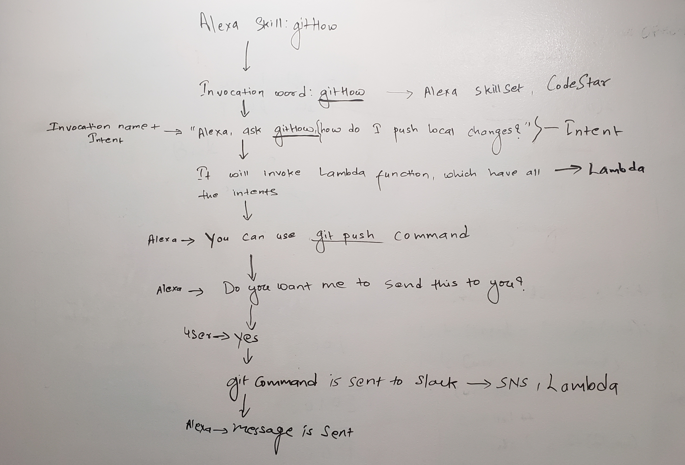

# Alexa Gits Me

This is an Alexa Skill that will answer user git questions, and, if you want, will send you a text with the command.

## Software Requirements

[Software Requirements](requirements.md)

## Project Management Board

[Trello](https://trello.com/b/KSdLCHPI/githow)

## User Stories

- _As a user_

  - I want to ask what is the command for a certain git action.
  - I want to hear what is the command for a certain git action
  - I want a message sent to my phone so that I can see what it looks like, after I ask Alexa.

- _As a developer_
  - I want to create an Alexa skill that will answer a git question
  - I want to give the user the correct git command to their git question
  - I want to utilize Lambda functions as a way to adhere to SOLID principles.
  - I want to utilize an SNS Queue system to send a message to the user with the git command.

## Wireframes
  
[Decision Tree](https://app.moqups.com/uluAsPw28y/view/page/aa9df7b72)
* White board image

## Resources

[Tutorial](https://developer.amazon.com/blogs/alexa/post/a9ef18b2-ef68-44d4-86eb-dbdb293853bb/alexa-skill-recipe-making-http-requests-to-get-data-from-an-external-api) on how to make an Alexa Skill

[Free Code Camp](https://www.youtube.com/watch?v=QkbXjknPoXc)

[Github Repo](https://github.com/alexa/skill-sample-nodejs-fact) of how to build an Alexa Skill

## Team Members

[sapanapoudel](https://github.com/sapanapoudel)

[Nhuuu](https://github.com/Nhuuu)

[rttgg](https://github.com/rttgg)

[BomiBear](https://github.com/bomibear)
